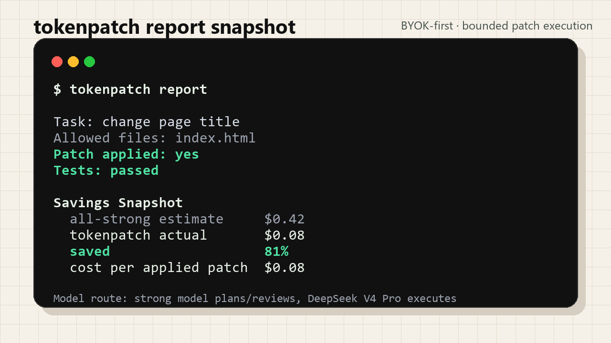

# tokenpatch

Save AI coding tokens without switching editors.

[tokenpatch.com](https://tokenpatch.com) · [Quickstart](docs/QUICKSTART.md) · [Install](docs/INSTALL.md) · [Demo evidence](docs/DEMO.md)

tokenpatch lets Codex, Cursor, Claude Code, CLI agents, and MCP clients keep their configured strong model in charge, then route bounded implementation patches to a cheaper executor such as DeepSeek V4 Pro.

The metric is not just request cost. tokenpatch focuses on **cost per applied AI coding patch**.



## Quick Start

The first public release is BYOK-first. Bring your own DeepSeek API key.

```bash
pip install git+https://github.com/Leoyen1/tokenpatch.git
tokenpatch bootstrap
```

Set executor credentials in your app's MCP environment settings, shell, or `~/.tokenpatch/config.toml`:

```text
MMDEV_EXECUTOR_PROVIDER=deepseek_byok
DEEPSEEK_API_KEY=your-deepseek-key
DEEPSEEK_BASE_URL=https://api.deepseek.com
DEEPSEEK_EXECUTOR_MODEL=deepseek-v4-pro
```

Then ask inside Codex, Claude Code, Cursor, or another coding agent:

```text
tp: change the page title. Only modify index.html.
```

Check the result:

```bash
tokenpatch metrics
tokenpatch report
```

## What You Get

- Keep using Codex, Claude Code, Cursor, or your own agent.
- Route bounded implementation work to a lower-cost executor.
- Check `allowed_files` before applying patches.
- Create local recovery checkpoints before AI edits.
- Report actual executor cost, all-strong baseline estimate, savings ratio, and cost per applied patch.
- Keep GPT/Claude keys in your existing coding app; tokenpatch only needs executor credentials for App Mode.

## Example Report Signal

```text
Task: change page title, only modify index.html
All-strong estimate: $0.42
tokenpatch actual: $0.08
Saved: 81%
Patch applied: yes
Tests: passed
```

The numbers above are an illustrative demo snapshot, not a universal guarantee. Real savings depend on task size, retries, model pricing, cache behavior, and review strategy.

## How It Works

```text
Strong model plans and reviews
        |
        v
tokenpatch creates a bounded executor task
        |
        v
DeepSeek V4 Pro writes the patch
        |
        v
tokenpatch checks allowed_files, applies the patch, and reports cost
```

## Works With

- Codex App and Codex CLI
- Claude Code
- Cursor
- VS Code / Cline / other MCP-capable agents
- Terminal workflows and CI

You can ask in any language. The docs, UI labels, metrics, and structured reports are English-first.

## BYOK First, Hosted Credits Later

The open-source client works today with your own DeepSeek API key.

Hosted tokenpatch.com credits are planned later for users who cannot easily get, recharge, or manage a DeepSeek key directly. The hosted path is optional and private beta first. tokenpatch should not be described as an official DeepSeek reseller or as endorsed by DeepSeek.

## Docs

- [Quickstart](docs/QUICKSTART.md)
- [Install Guide](docs/INSTALL.md)
- [Demo Evidence](docs/DEMO.md)
- [FAQ](docs/FAQ.md)
- [MCP Client Setup](docs/MCP_CLIENTS.md)
- [Integration Guide](docs/INTEGRATIONS.md)
- [Savings Estimates](docs/SAVINGS.md)
- [GitHub Publication Review](docs/GITHUB_PUBLICATION.md)
- [Public Release Manifest](docs/PUBLIC_RELEASE_MANIFEST.md)

## Common Commands

```bash
tokenpatch bootstrap
tokenpatch do "Implement a small change" --allowed-file path/to/file
tp do "Implement a small change" --allowed-file path/to/file
tokenpatch metrics
tokenpatch report
```

Advanced commands such as `plan`, `run`, `validate`, `review`, `checkpoint`, `memory`, `web`, and `mcp` are documented in the [Quickstart](docs/QUICKSTART.md) and [Install Guide](docs/INSTALL.md).

Compatibility note: legacy `mmdev` internals remain for older scripts, but the public project name is tokenpatch.

## Development

```bash
git clone https://github.com/Leoyen1/tokenpatch
cd tokenpatch
python -m pip install -e ".[test,web]"
python -m pytest -q
```

CI runs unit tests and example tests through GitHub Actions.
